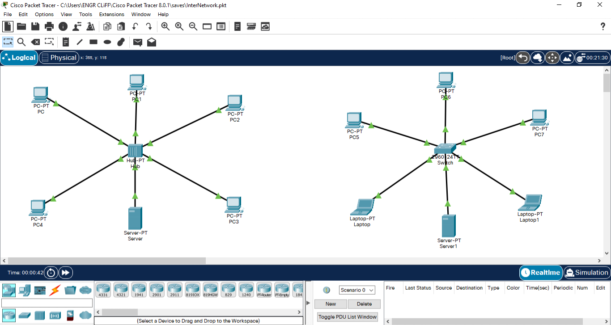
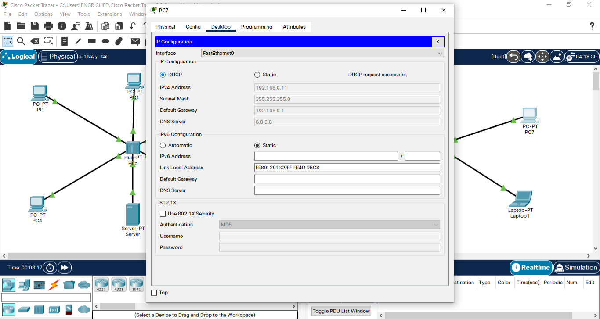
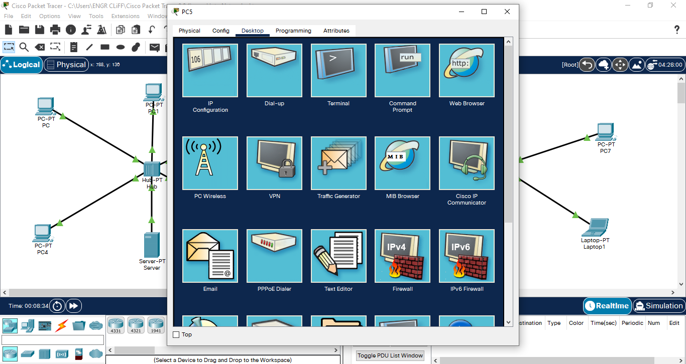
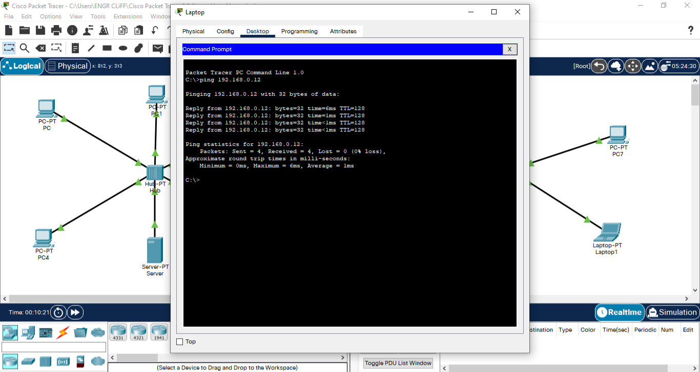
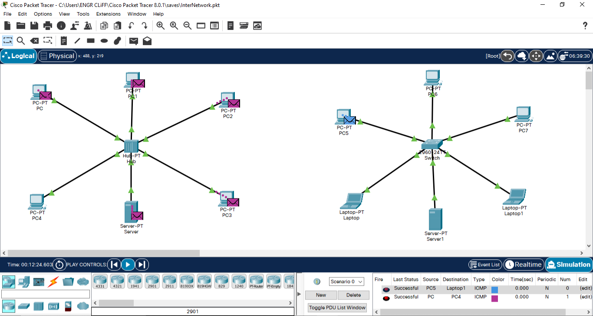

# Network-traffic-security-analysis
This project presents a Cisco Packet Tracer simulation I developed to demonstrate the security and operational differences between Ethernet hubs and switches. It was created during the ICT YEP Innovation Hub Cybersecurity Training Programme organised by the Delta State Government.

During networking sessions, many trainees found it difficult to understand the practical differences between Ethernet hubs and switches through theoretical explanations alone. To reinforce these concepts, I designed and delivered a live Cisco Packet Tracer demonstration illustrating packet broadcasting, MAC address learning, switching behaviour, and packet visibility. The practical simulation helped participants better understand the security implications of hub- and switch-based networks through a visual, hands-on demonstration.

---

## 🎯 Technical Objectives
- Demonstrate how hubs broadcast all packets to every connected device.  
- Show how switches learn MAC addresses and forward frames intelligently.  
- Analyze packet movement using Cisco Packet Tracer simulation mode.  
- Explain cybersecurity implications such as packet sniffing risks.
- Introduce basic configurations including IP addressing and interface control.

 ---

- ## ⚡ Key Features
**Hub Behavior Analysis** 
- Broadcasts all traffic across the network
- No segmentation or filtering
- High vulnerability to sniffing attacks

**Switch Behavior Analysis**
- Learns MAC addresses dynamically
- Forwards frames only to their intended recipients
- Improves confidentiality and network performance

**Traffic Simulation**
- Visual packet flow analysis
- Event inspection using simulation mode
- MAC table verification for switching logic

---

## 🔧 Technologies & Tools
- Cisco Packet Tracer
- Layer 2 Switch
- Hub
- Router (optional for extended configurations)
- Basic CLI commands in exec, privilege, and global configuration modes

---

## 🛡️ Cybersecurity Relevance
Understanding the behavioural differences between hubs and switches is fundamental to network security.

This simulation demonstrates how:
- hubs broadcast traffic to every connected device,
- switches reduce unnecessary packet exposure,
- MAC address learning improves confidentiality,
- proper network segmentation reduces packet sniffing opportunities.

---
 
## 📸 Screenshots & Results
### Network Topology Overview

Demonstrates identical network layouts implemented with a hub and a Layer 2 switch to compare traffic forwarding behaviour.

### Device Configuration Interface

### Packet Simulation View

Cisco Packet Tracer simulation mode illustrating how broadcast traffic differs between hub-based and switch-based networks.

### Switch MAC Table Output

### Hub vs Switch Traffic Flow Comparison

Demonstrates how hubs broadcast traffic to all connected devices, while switches intelligently forward packets only to the intended recipient using MAC address learning.

---

## ✅ Key Learning Outcomes
- Demonstrated practical understanding of Layer 2 switching.
- Visualized MAC address learning.
- Compared packet visibility in hub and switch environments.
- Explained packet sniffing risks using live simulation.
- Reinforced cybersecurity concepts through hands-on networking demonstrations.

---

## 📚 Use Case
This project serves as a practical teaching aid for networking and cybersecurity learners by visually demonstrating the security implications of device selection within Ethernet networks. It was originally used during a live classroom demonstration to help trainees understand concepts that were difficult to grasp through theory alone.

---

## 📄 License
This project is intended for educational demonstration, academic research, and portfolio presentation purposes.
